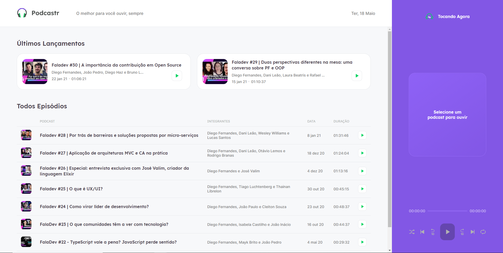
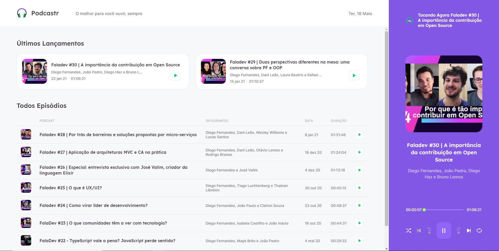
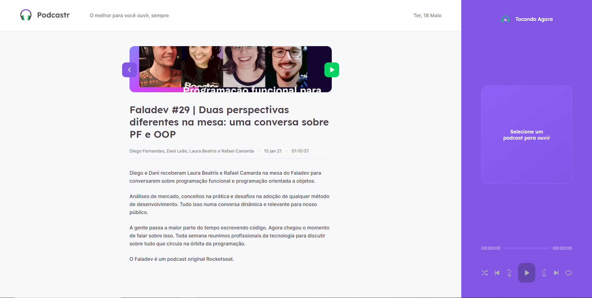

<div align="center">
  
</div>

# PodcastrNext

  [](https://github.com/gi-carnaval)
  [](#)
  [](https://github.com/gi-carnaval/NextPodcast/stargazers)

<div align="center">
  
  ### Player Vazio
  
  
  <br/>
  
  ### Tocando um Episódio
  
  
  <br/>
  
  ### Detalhes do Episódio
  
  
</div>

#### _Feito_

-   [x] Controles de Audio.
-   [x] Botão para avançar ou retroceder 10 segundos.

#### _Em Andamento_

- [ ] Tema Escuro.
- [ ] Responsividade.

## 🧪 Tecnologias

Este projeto foi desenvolvido usando as seguintes tenologias:

- [Next.js](https://nextjs.org/)
- [React](https://reactjs.org)
- [TypeScript](https://www.typescriptlang.org/)

## 🚀 Iniciando

Clone o projeto e acesse a pasta:

```bash
$ git clone https://github.com/gi-carnaval/NextPodcast.git && cd NextPodcast
```

Siga os passos abaixo:
```bash
# Install the dependencies
$ yarn

# Run the JSON server
$ yarn server

# Start the project
$ yarn dev
```

## 💻 Projeto

[Podcastr](https://podcastr-nlw.vercel.app/) para te trazer mais perto do melhor da tecnologia! 

Este projeto foi desenvolvido durante a **[Next Level Week](https://nextlevelweek.com/)**, apresentada pela **[@Rocketseat](https://github.com/Rocketseat)** .

## 🔖 Layout

Você pode visitar o layout do projeto acessando o link abaixo:

- [Layout Web](https://www.figma.com/file/UwFEntsHpHYJlHNQAQr4gA/Podcastr?node-id=160%3A2761) 

## 📝 Licença

Este projeto é licenciado pela MIT License.


---

<p align="center">Feito por Giovani Carnaval</p>

